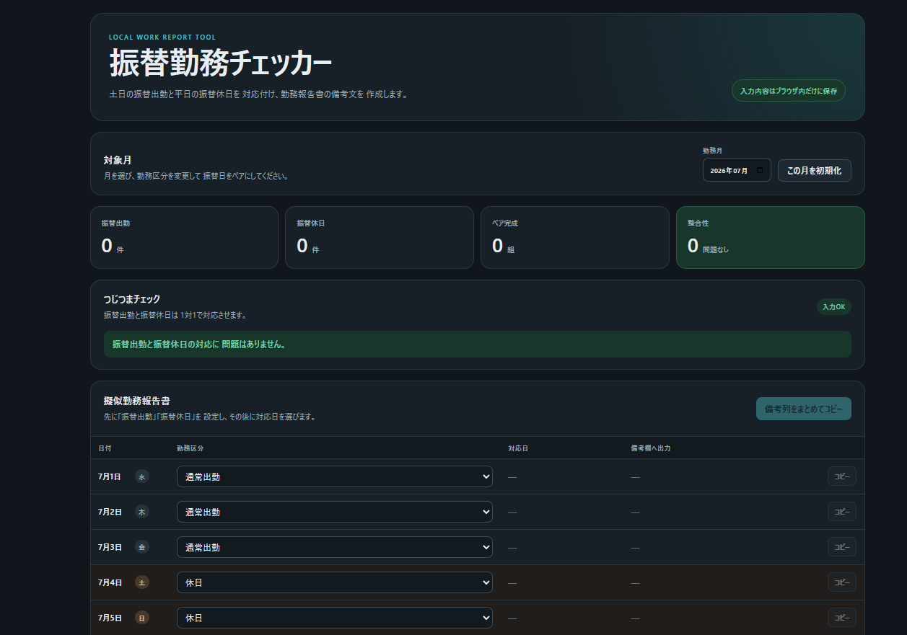

# Furikae Checker

振替出勤と振替休日を対応付け、日付に応じたメモを生成するWebアプリです。

## Demo

https://ryohei0otsuka.github.io/furikae-checker/

## Screenshot



## Features

* 月ごとの日付と曜日を自動生成
* 振替出勤と振替休日のペア設定
* 未設定や件数不一致のチェック
* 対応する日付からメモを生成
* メモの個別コピー
* 1か月分のメモを一括コピー
* ブラウザへの自動保存

## Example

| 日付    | 区分   | 生成されるメモ    |
| ----- | ---- | ---------- |
| 2月7日  | 振替出勤 | 2月10日の振替出勤 |
| 2月10日 | 振替休日 | 2月7日の振替休日  |

## Tech Stack

* React
* TypeScript
* Vite
* CSS
* localStorage

## Setup

```bash
git clone https://github.com/Ryohei0Otsuka/furikae-checker.git
cd furikae-checker
npm install
npm run dev
```

## Build

```bash
npm run build
```

## Privacy

入力内容はブラウザ内に保存され、外部サーバーへ送信されません。

スクリーンショットやサンプルには架空のデータを使用しています。

## License

MIT License
